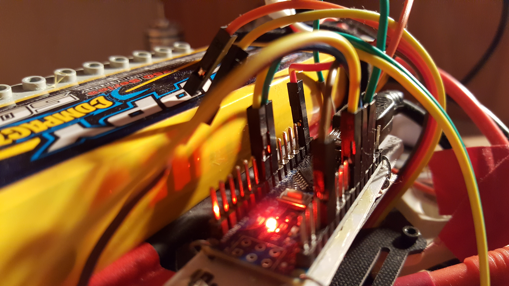
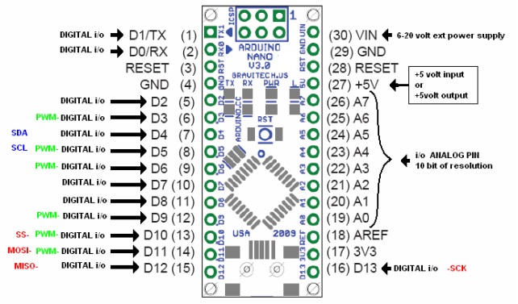

# Quadrocopter

## Description
This repository holds the code to calibrate, test and control a Quadrocopter with an arduino.

The core of the algorithm is a PID controller which reacts to control input by the radio
controller and the IMU. The IMU measurements indicate the current angle of the quadrocopter are
smoothed by a Kalman filter. The control output are motor signals for the 4 brushless motors.
All code is written for the Arduino IDE.

Additionally, the quadrocopter was equipped with a Raspberry Pi to stream a USB camera to a smartphone over Wifi.

## Contents
* PIDcontrol: Contains the PID controller to control the motor signals.
* readIMU: Code to read IMU measurements.
* calibration: Calibration of the motors.
* kalmanFilter: Test kalman filter of IMU measurements.
* scanForI2C: Check arduino I2C connection to connect a Raspberry Pi.
* writeMotorValue: Test motors with given input value.
* writeValueToOneMotor: Test one Motor.